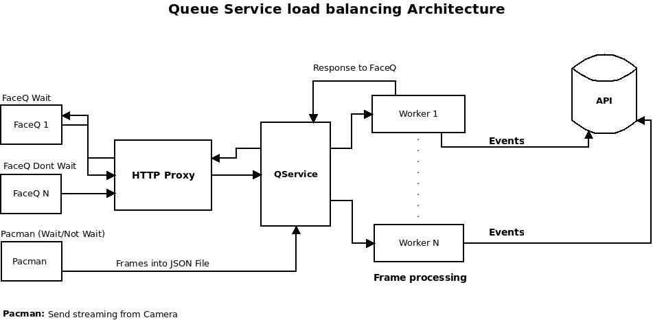

# ZEYE Queue Facial Recognition services
Software de reconocimiento facial manejado por colas.

Los siguientes servicios utilizan:
- OPENCV para streaming de video
- MTCNN para la detección de rostro
- DLIB para obtener encodings del rostro
- Faiss para hacer matching en la base de datos

## Arquitectura



- FaceQ (Face Query): Cualquier cliente que envie una consulta mediante http.

- Pacman: Recoge streaming desde una camara, detecta si hay movimiento y si lo hay, envia dicho frame mediante sockets al QService.

- HTTP Proxy: Servidor proxy para el envio de consultas via http.

- QService: Este servidor actua de middleware entre la pacman, los QFace y los Workers. Obtiene los frames enviados via http o via socket, los encola si no hay worker disponible y cuando haya un worker disponible, los envia a este disponible para realizar Reconocimiento facial sobre este utilizando balanceo de carga.

- Worker: Realiza detección de rostros y reconocimiento facial sobre los frames recibidos y envia la respuesta ala api para el registro de los eventos de deteccion.

## Instalación
Dependencias: OpenCV 4.0.1+, zmq, imutils, Tensorflow 1.8+, faiss, mongoengine, mtcnn, face_recognition, uuid.

- Probado en Ubuntu Linux 16.04 con y sin GPU.
- Instalar OpenCV 4.0.1+. Recomendado instalar con ```pip3 install opencv-python``` o compilarlo con soporte para GPU (En caso de tener una).
- Instalar Tensorflow (1.5+) ```pip3 install tensorflow``` o ```pip3 install tensorflow-gpu``` (Recomendado).
- Instalar zmq. ````pip3 install pyzmq```
- Instalar imutils ```pip3 install imutils```
- Instalar dlib (Compilar con soporte para GPU, en caso de que se vaya a usar detectionTest.py o worker.py)
- Instalar face_recognition
- Instalar faiss ```pip3 install faiss-cpu``` (Soporte para GPU recomendado).

## Estructura de directorios

La estructura de directorios es la siguiente:

1. **doc**: Archivos de documentación.
2. **pacman:** Contiene el detectioTest.py para leer streaming y queueProcess para cargar y enviar frames en JSON (por los momentos se hace via http este proceso).
3. **services:** Contiene servidor proxy para consultas hechas mediante http y el minddleware con sockets tcp.
4. **workers:** Contiene workers para reconocimiento facial.

## Instrucciones de uso

#### Pacman:
- ```sudo python3 detectorTest.py [url-camara]```

#### Services
- ```python3 proxy.py```
- ```python3 httpd.py```

#### workers
- ```python3 worker.py```

## Requerimientos

### Pacman
- [OpenCV 4.0.1+] (https://opencv.org)
- [ZMQ] (https://pyzmq.readthedocs.io/en/latest/)
- [dlib] (https://)

### services
- zmq
- json
- flask

### workers
- OpenCV
- zmq
- imutils
- MTCNN
- Tensorflow 1.5+
- faiss
- face_recognition
- mongoengine

## Licencia

MIT

Contribuidores: **José Chourio**, **Adrian Trononis**, **Delkys Welffer**