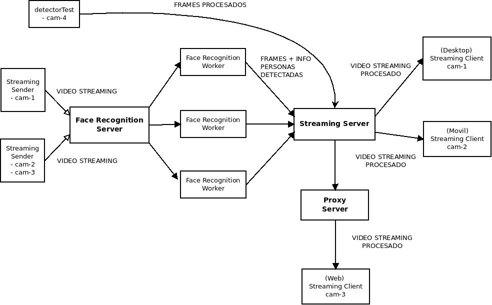

# ZEYE facial recognition
Software de reconocimiento facial en tiempo real.

Este software utiliza:
- MTCNN para la detección de rostro
- DLIB para obtener encodings del rostro
- Faiss para hacer matching en la base de datos

## Arquitectura
